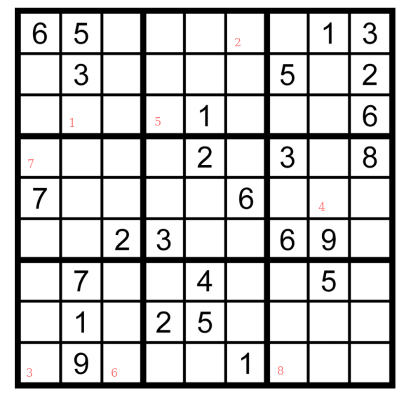

Erstes Rätsel
=============

Gut gemacht.

Hier kommt nun das erste richtige Rätsel. Du findest es bei den Ausdrucken
mit der Überschrift "01", falls Du es lieber ausgedruckt lösen
möchtest.

Löse das Sudoku und merke Dir die markierten Felder
in der markierten Reihenfolge. Drücke unten auf "Weiter"
und füge dann in der Adresszeile die Ziffern an.
Ähnlich, wie Du es eben schon gemacht hast!
Mit etwas Glück geht es dort dann "weiter"! Viel
Glück!

[Weiter](02-)

<!-- 22225558 -->

Falls Du nicht weiterkommst: Hier die Lösung zum ["spickeln"](/loesungen/01)!

Wenn garnix hilft (oder ich die Lösung falsch ermittelt habe - sorry),
dann gibt es einen Notfallcode. Der ist "487024404107598782".
Den kannst Du statt der Lösung auch verwenden!
