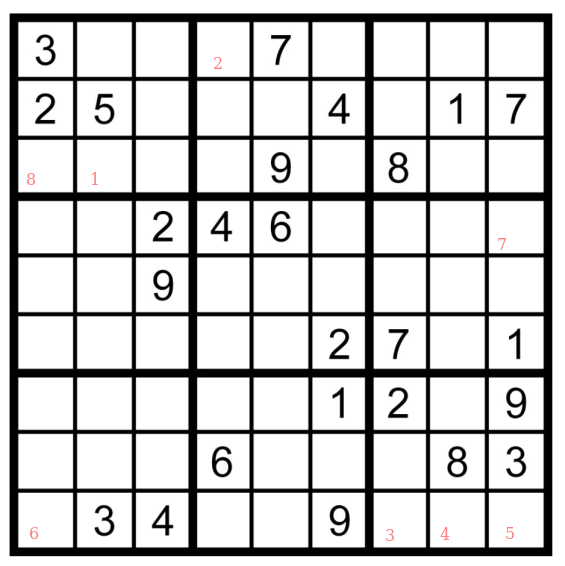

Zweites Rätsel
==============

Hier kommt gleich das zweite Rätsel. Du findest es bei den Ausdrucken
mit der Überschrift "44", falls Du es lieber ausgedruckt lösen
möchtest.

Löse das Sudoku und merke Dir die markierten Felder
in der markierten Reihenfolge. Drücke unten auf "Weiter"
und füge dann in der Adresszeile die Ziffern an.
Mit etwas Glück geht es dort dann "weiter"! Viel
Glück!

<a href="/index.html#03-.md">Weiter</a>

<!-- 21675189 -->

Falls Du nicht weiterkommst: Notfallcode ist "587024404107598783".
Den kannst Du auch verwenden!
