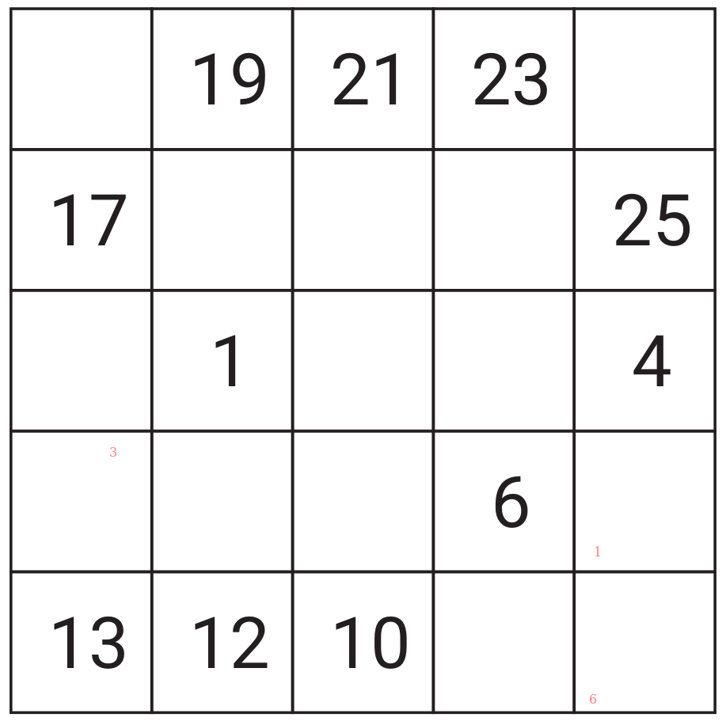

Drittes Rätsel - Erklärung
==========================

Prima, das zweite Rätsel hat auch geklappt!

Jetzt kommt ein neuer Rätseltyp in's Spiel: HIDOKU.

Hidoku - die Zahlenschlange
---------------------------

Das Rätsel sieht dem klassischen Sudoku zunächst recht
ähnlich, folgt aber ganz anderen Regeln. Das Gitter, das mit
Zahlen gefüllt werden muss, ist nicht in einzelne
Abschnitte unterteilt und kann neben der quadratischen
alle möglichen Formen annehmen. Wichtig ist nur, dass
jede Zelle im Gitter an eine andere Zelle anschließt.

Zu Beginn sind einige Zellen bereits ausgefüllt. Ziel des
Logikrätsels ist es, das Gitter vollständig mit einer
zusammenhängenden Zahlenreihe zu füllen, wobei die
Zahlenmenge durch die Anzahl der Zellen bestimmt wird.

Hidoku Beispiel - ein Gitter von 4 mal 4 Zellen
-----------------------------------------------

- Einzutragen sind die Zahlen von 1 bis 16, jede kommt
  nur einmal vor.

- Die Regel besagt, dass jede Zahl senkrecht, waagrecht oder diagonal an
  aufeinanderfolgende Zahlen angrenzen muss. In einer der acht angrenzenden Zellen
  um die 8 muss also die 7, in einer anderen die 9 stehen.

- Zu Beginn sind einige Zahlen vorgegeben. Sie bestimmen, welche Wege dem Spieler
  offen stehen, um die Zahlen so einzutragen, dass die Regel eingehalten wird.

- Das Rätsel ist gelöst, wenn sich eine zusammenhängende Zahlenreihe
  (Zahlenschlange) von 1 bis 16 ergibt, bei der der Spieler die Reihe mit einem Bleistift
  nachzeichnen kann, ohne abzusetzen.

Je nach Gittergröße, Anzahl und Anordnung der vorgegebenen Zahlen kann das Hidoku
natürlich leichter oder schwerer ausfallen.

Drittes Rätsel
--------------

Ausdruck: Überschrift 27!

<!--
  1=5
  2=8
  3=14
  4=2
  5=13
  6=7
  7=9

581421379
-->

<a href="/index.html#04-.md">Weiter</a>

Lösung: <a href="/index.html#/loesungen/27.md">Spicker</a>

Notfallcode: 471124404107598782
