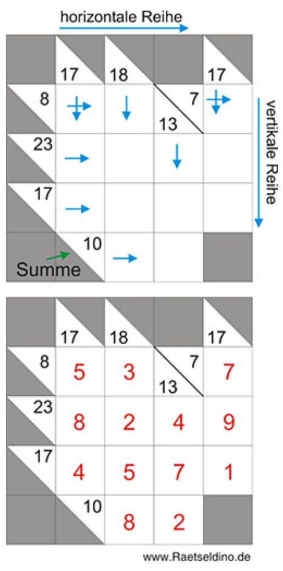

Kakuro
======

Wieder mal was neues: Kakuro!

Kakuro lässt sich am einfachsten mit einem Zahlen
Kreuzworträtsel vergleichen. Die Lösungen beruhen auf
einfachen Additionen. Die Summen der Additionen sind
bereits im Kakurogitter hinterlegt.

Die Grundregeln sind sehr leicht zu lernen:

- Nur die Zahlen von 1 bis 9 dürfen in die leeren Zellen eingetragen werden.
- Jede dieser Zahlen darf nur einmal in einer horizontalen oder vertikalen Reihe verwendet werden.
- Die horizontalen Reihen verlaufen immer von links nach rechts und die vertikalen Reihe von oben nach unten.
- Die Summe der eingetragenen Zahlen muss sich mit der vorgegeben Summenzahl decken.

Kleine Tipps für Kakuro und Lösungsbeispiel

Schauen wir uns das nebenstehende Beispiel einmal genauer an. Beginnen wir in der oberen
linken Ecke. In der horizontalen Reihe wurde die Summenzahl 8 vorgegeben. In der vertikalen
Reihe die Zahl 17.

Um die Zahl 8 als Summe zu erreichen, bietet das Gitter 2 leere Zellen an. Somit kann die Lösung
nur eine Kombination aus zwei Zahlen sein. In unserem Fall ist es eine Kombination aus den
Zahlen 5 und 3.

Bei der Lösungszahl 17 werden drei leere Zellen vorgegeben. Da die erste Zahl bereits bekannt ist
(5) müssen nun noch zwei weitere Zahlen gefunden werden, die zusammen die Zahl 17 ergeben.
In diesem Fall die Zahlen 8 und 4.

Beim weiteren Vorgehen im Kakuro-Rätsel, müssen Sie aber beachten, dass die Zahlen 1 bis 9
immer nur einmal in den entsprechenden Reihen verwendet werden dürfen. Die Summe 10
(siehe ganz unten im Beispiel) kann also niemals aus den beiden Zahlen 5 und 5 entstehen.

Da man vor allem am Anfang immer mal wieder eine Zahl aus dem Gitter ersetzten oder
umbenennen muss, empfiehlt es sich, dieses Logikrätsel mit einem Bleistift auszufüllen.

<a href="/index.html#08-4711.md">Weiter</a>
