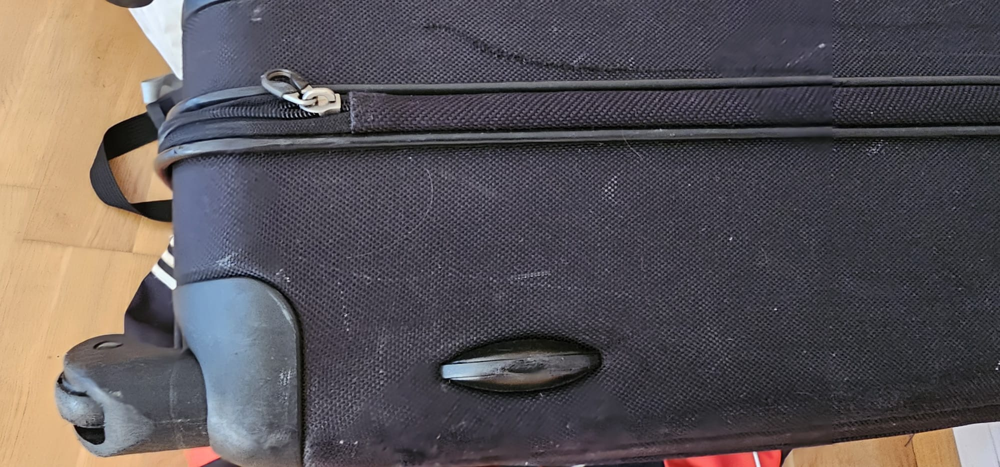

# Putzpower vorhanden

Du hast bewiesen, dass Du über die notwendige
Putzpower verfügst. Damit bist Du weiterhin im Rennen für den
Erhalt der Kleinigkeit und kannst Dich immer noch freuen!

# Dritte Aufgabe: Urlaub

Für die dritte Aufgabe mußt Du
Reisequalitäten aufweisen. Finde
das abgebildete Gepäckstück
samt Codewort:

Ergänze das Codewort um "trainingslager"
und gib dieses Lösungswort ein!

<input id="footerUrl" type="text" style="display:none;"/>

Lösungswort Urlaub:  <input type="text" id="digits" value=""/>
 <input type="button" onclick="weiter()" value="Weiter" />
