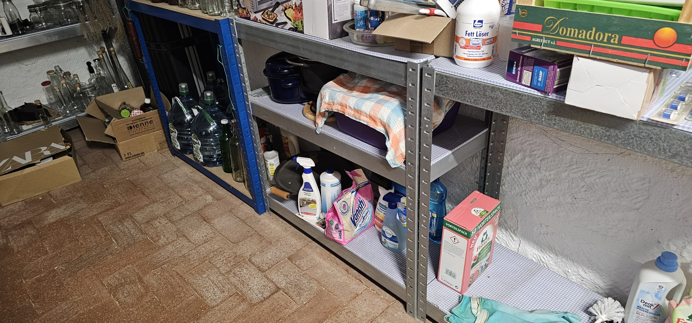
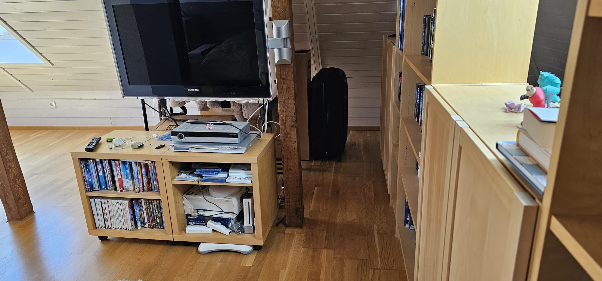

# Lilly Lösungen

## Testaufgabe

Lösung Testaufgabe (start.html)

esel

## Bauernschläue

Lösung Bauernschläue

vier

## Putzmittel

Ort Putzmittel

Lösung Putzmittel

ichputzegernesonntags

## Urlaub

Ort Gepäck

Lösungswort am Rad

Lösung Urlaub

wandertrainingslager

## Fahrrad

Lösung Fahrrad

nixplatt

## Mathe

Lösung Mathe

1000

## Biologie

Lösung Biologie

big5

## Quantenphysik

Lösung Quantenphysik

egal

## Geschafft

Hier befindet sich die Kleinigkeit

- Keller
- Vorraum zum tiefen Keller
- Stapel von Lilly
- Zweiter Karton von oben

