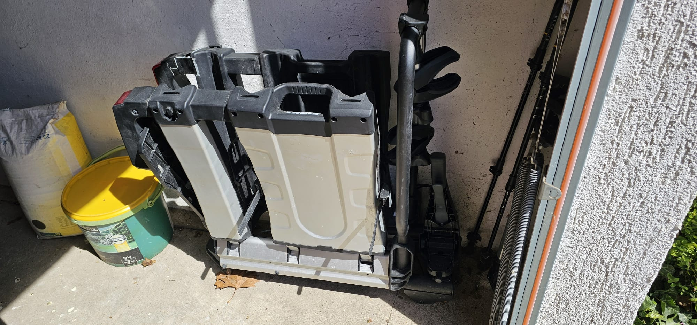

# Urlaubswille besteht

Du bist bereit für Gewaltmärsche - super!
Damit bin ich zuversichtlich, dass Du es auch
bis zur Kleinigkeit schaffst! Du bist immer
noch "im Rennen" und kannst weitermachen.

# Vierte Aufgabe: Fahrrad

Wo ein Urlaub ist, da auch ein Fahrrad.

Natürlich wäre ein Fahrrad als Suchbild viel zu einfach.
Da weißt Du ja sofort, wo das ist. Hier ein Bild eines
"Begleitgegenstandes". Finde ihn und das Codewort!

Begleitgegenstand

Nimm einfach das Codewort und gebe es unten ein!

<input id="footerUrl" type="text" style="display:none;"/>

Codewort Fahrrad:  <input type="text" id="digits" value=""/>
 <input type="button" onclick="weiter()" value="Weiter" />
