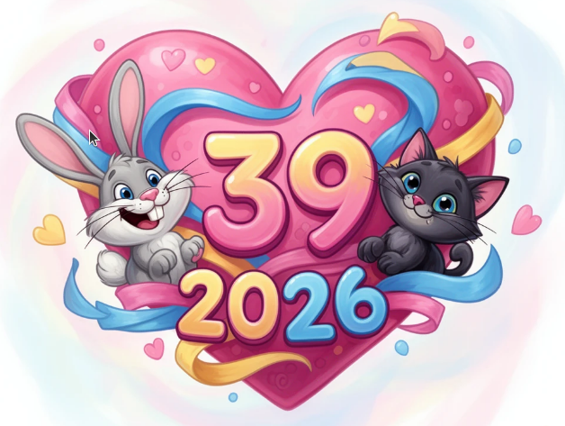

# Alles Gute zum Geburtstag 2026!

Mein lieber Schatz! Erstmal einen dicken Schmatz!
Heute hast Du Geburtstag, leider können wir ihn nicht direkt
zusammen feiern. Das ist sehr schade! Wir holen es aber nach
im Urlaub in Innsbruck und Italien.

Zum Trost habe ich eine Kleinigkeit vorbereitet.
Wenn Du Glück hast, dann gibt Dir jemand Hilfestellung.
Wenn nicht, dann nicht!

Um an die Kleinigkeit zu kommen, mußt Du ein paar
Rätsel lösen. Den Lösungsbegriff mußt Du unten eingeben.
Wenn er richtig ist, dann geht's weiter. Wenn nicht,
dann nicht. Alle Lösungsbegriffe bestehen nur aus
Kleinbuchstaben und Ziffern!

Tipp: Gib' gleich unten mal die falsche Antwort "in brauche kein mathe"
ein, dann siehst Du, wie es aussieht wenn Du einen Fehler machst.
Du mußt dann im Browser auf "zurück" drücken, damit Du die
Antwort korrigieren kannst. Ich hoffe, Du kommst damit klar!

Tipp für äußerste Notfälle: +49-17273-05646

# Testaufgabe

Wie heißt der Bürgermeister von Wesel?

<input id="footerUrl" type="text" style="display:none;"/>

Erste Lösungszahl:  <input type="text" id="digits" value=""/>
 <input type="button" onclick="weiter()" value="Weiter" />
