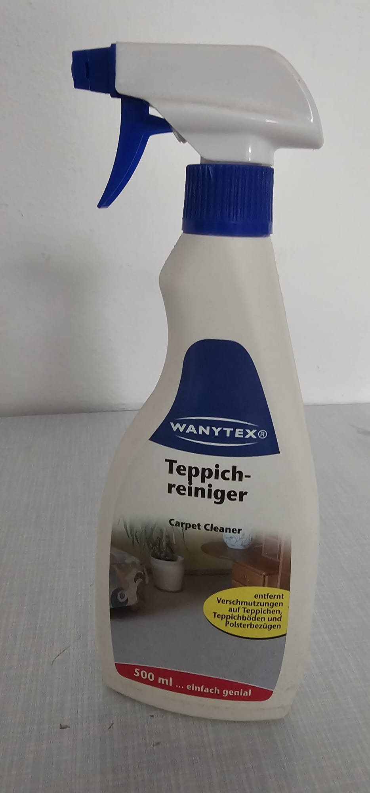

# Bauernschläue vorhanden

Du hast bewiesen, dass Du über die notwendige
Bauernschläue verfügst. Damit bist Du für den
Erhalt der Kleinigkeit grundsätzlich qualifiziert
und kannst Dich schonmal freuen!

# Hinweis auf die Kleinigkeit

Die Kleinigkeit ist garnicht so klein!

# Zweite Aufgabe: Putzmittel

Für die zweite Aufgabe mußt Du beweisen, dass Du
Dich mit Putzmitteln auskennst.

Schau Dir dieses Bild genau an:

Versuche, das abgebildete Putzmittel zu finden.
Mit etwas Glück findest Du dort auch das Codewort
für die Antwort! Merke Dir dieses Codewort und stelle
den Satzteil: "ichputzegerne" voran. Diese Kombination
ist dann der Lösungssatz!

<input id="footerUrl" type="text" style="display:none;"/>

Lösungssatz Putzmittel:  <input type="text" id="digits" value=""/>
 <input type="button" onclick="weiter()" value="Weiter" />
